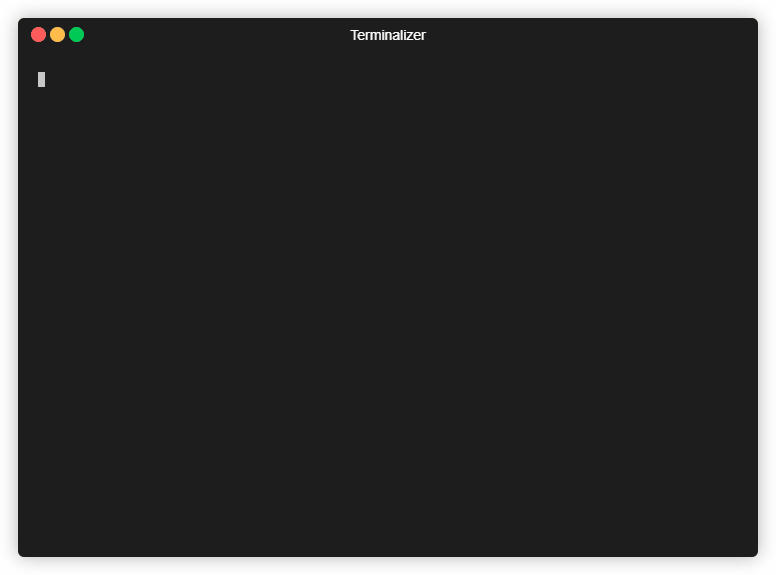

# Robocraft email verification code bruteforcer

> Made to bypass the email verification code when using the "forget password" feature ins Robocraft

# Notice
This script is just a proof of concept. It is not meant to be used for serious attacks. <br>
Taking over accounts without the owner's permission is <b>illegal</b> and punishable by law in many countries. <br>
This was just made as a poc in an evening. After starting Robocraft again after a few years.


## Installation

First, you need python 3.6 or higher. <br>
First way of doing it:
```bash
pip install -r requirements.txt
```
> might mess up your other dependencies.

Second way of doing it:
```bash
pipenv install
pipenv run bruteforce.py
```
> pipenv is a great tool to manage your dependencies.

Done.

## Usage

First you need to edit the bruteforce.py file and change the email AND the account-id/PublicId, the account-id is either an uuid v4 or a username which is not always the same as the
displayed name!
There are ways to find the account-id/PublicId, but you need to find them yourself.<br>
Getting the email address is the hardest part, you need to rely on either guesswork, social engineering or old dumps.<br>
WARNING: This can only work on accounts that have a password set, many accounts are just made through Steam and have no password & email set which hinders the bruteforce.<br>
Note: This will result in alot of emails being sent to the email address, so make sure you have a valid email address.<br>

```bash
python bruteforce.py
```



## How it works

It works by sending multiple forget password requests to the server which will then send a verification code to the email address provided.<br>
This highers our chance to correctly guess the verification code/to guess it alot faster. This is possible because robocraft doesn't invalidate them instantly.<br>
Another advantage is that the code is only 4 characters long and only exists of capital letters and numbers.<br>
Which makes bruteforcing it much easier.
